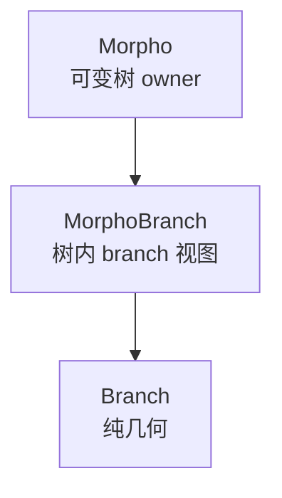
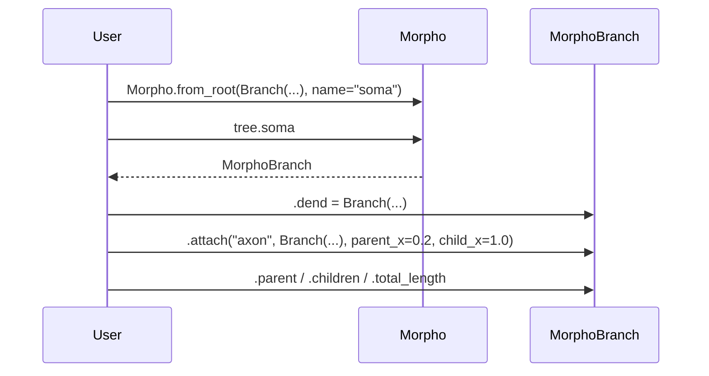

# 方案一 `morpho` 结构图

这版 `morpho` 只保留一个公开树对象：`Morpho`。

结论先说：

- `Branch` 是纯几何值对象
- `Morpho` 是唯一公开的形态树，负责编辑、查询和连接关系
- `MorphoBranch` 是用户真正操作的 branch 视图
- 不再有公开 `Morphology` 或 `snapshot()`

## 主结构图



对应含义：

- `Branch` 只描述单条分支自己的几何
- `Morpho` 负责“树里有哪些分支、它们如何连接、名字归谁所有”
- `MorphoBranch` 是 `Morpho` 里的某个分支视图
- `MorphoBranch` 同时暴露：
  - `Branch` 的几何属性
  - 树内的拓扑关系
  - 局部编辑入口
- `Branch` 本身直接存段级几何，不再额外包 `Frustum`
- 所有几何量都基于 `brainunit`，在 `Branch` 内部统一规范化到 `u.um`

## 最常见的调用流



也就是说：

1. 用户创建一棵 `Morpho`
2. 访问 `tree.soma` 时拿到 `MorphoBranch`
3. 在 `MorphoBranch` 上继续挂子分支，或者直接读几何和拓扑信息
4. `vis / filter / cell` 都直接消费整棵 `Morpho`

另外：

- 父节点上的属性名只是局部访问槽位，例如 `tree.soma.dend`
- 如果 `Branch.name is None`，最终 branch 名会自动生成为 `type_N`
- 因此槽位名和最终 branch 名可以不同

## 公开接口怎么分工

`Branch`：

- `lengths`
- `radii_prox`
- `radii_dist`
- `proximal_points`
- `distal_points`
- `name`
- `type`
- `n_segments`
- `total_length`
- `radius_proximal`
- `radius_distal`

这些字段在运行时都是 `brainunit Quantity`。构造入口接受：

- `Quantity`
- Python `list`
- `numpy.ndarray`
- `jax` 数组

其中裸数值默认按 `u.um` 解释，进入 `Branch` 后统一规范化成带单位的内部格式。

`MorphoBranch`：

- 几何：直接透传 `Branch` 的属性和方法
- 拓扑：
  - `parent`
  - `parent_x`
  - `child_x`
  - `children`
  - `index`
- 编辑：
  - `attach(...)`
  - `tree.soma.dend = ...`
  - `tree.soma[0.3, 1.0].axon = ...`

注意：

- `MorphoBranch` 只用于局部编辑和局部查询
- 下游 `vis / filter / cell` 入口不再接受 `MorphoBranch`

`Morpho`：

- `root`
- `branches`
- `connections`
- `branch_by_name(...)`
- `branch_by_index(...)`
- `children_of(...)`
- `path_to_root(...)`
- `topo()`
- `attach(...)`
- 自动命名规则：`type_N`

## 为什么还需要 `MorphoBranch`

如果没有 `MorphoBranch`，那所有操作都得写成中心化形式：

```python
tree.attach(parent="soma", child="dend", branch=Branch(...))
```

这种方式能用，但会失去下面这些更自然的写法：

```python
tree.soma.dend = Branch(...)
tree.soma[0.25, 1.0].axon = Branch(...)
tree.soma.parent
tree.soma.total_length
tree.branch_by_name("apical_dendrite_0")
```

所以 `MorphoBranch` 的意义不是新增一种几何对象，而是把“树里的某个 branch”变成一个自然可操作的视图。

`Branch` 的几何构造主推 4 个显式入口：

- `Branch.lengths_shared(...)`
- `Branch.lengths_paired(...)`
- `Branch.xyz_shared(...)`
- `Branch.xyz_paired(...)`

## 为什么不再公开 `Morphology`

这里把边界重新收紧了：

- `morpho` 层负责描述、编辑、查询
- 是否需要不可变表示，是下游消费者自己的需求

因此：

- `vis` 和 `filter` 直接读 `Morpho`
- `cell` 如果需要 JAX 友好的稳定拓扑，会在编译边界内部冻结

用户不需要再在 `Morpho` 和 `Morphology` 之间切换。

## 一句话记忆

- `Branch`：单条分支的纯几何
- `Morpho`：整棵可变树
- `MorphoBranch`：树里的一个 branch 视图，既有几何接口，也有拓扑和编辑语义

## 当前实现状态

当前这部分已经是仓库里最成熟的一层：

- `Branch`、`Morpho`、`MorphoBranch` 都已有测试覆盖
- `Branch` 的单位规范化和四类构造入口已落地
- `Morpho` 的构树、语法糖挂接和基础拓扑查询已可运行
- `Morpho.topo()` 已可输出文本树拓扑
- 自动命名和“槽位名/最终名分离”已落地
- 主实现文件现在分布在：
  - `braincell/morpho/branch.py`
  - `braincell/morpho/morpho.py`
  - `braincell/morpho/metrics.py`

但以下内容仍未完成：

- `Branch.lateral_areas()`
- `Branch.volumes()`
- `io/asc/` 与 `io/neuroml2/` 中的 `AscReader` / `NeuroMlReader`
- `morpho/metrics.py` 中的路径与总体度量实现
