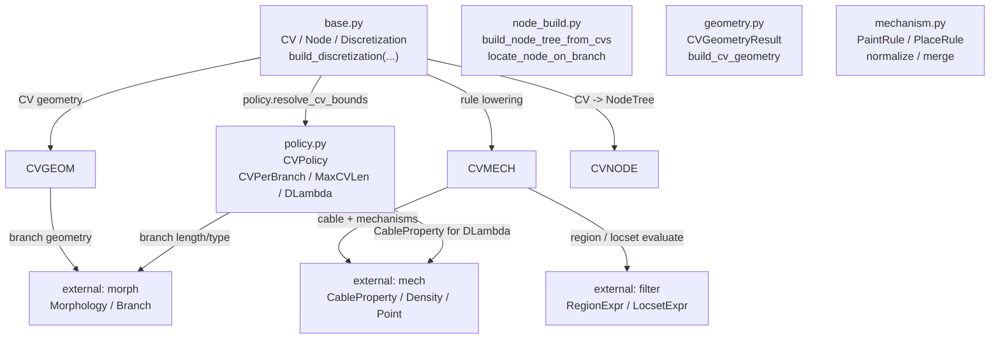
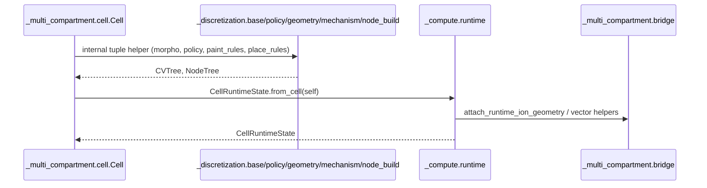
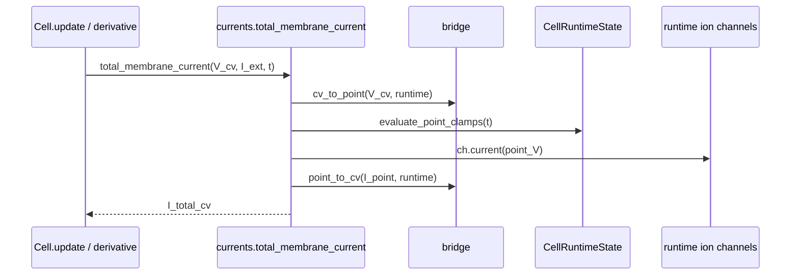

# `_multi_compartment` / `_discretization` / `_compute` 依赖图

本文只看三个目录之间和内部的关系：

- `braincell._multi_compartment`
- `braincell._discretization`
- `braincell._compute`

箭头含义：`A --> B` 表示 `A` 在实现上调用、导入或依赖 `B`。虚线表示 type-only、调试辅助或薄 re-export，不是主执行链路。

## 1. 三个包之间的主关系

```mermaid
flowchart LR
    MC["`_multi_compartment`<br/>Cell frontend<br/>cell / bridge / currents / probes / run"]
    CV["`_discretization`<br/>CV + node-tree declaration<br/>base / node_build / policy / geometry / mechanism"]
    CP["`_compute`<br/>runtime compile layer<br/>runtime / scheduling / table"]

    MC -->|"Cell.cvs / Cell.init_state<br/>build_discretization"| CV
    MC -->|"Cell.init_state<br/>CellRuntimeState.from_cell(...)"| CP
    CP -->|"runtime vector helpers<br/>cv_to_point / point_to_cv / scatter"| MC
    CP -->|"node scheduling consumes declaration node tree"| CV
```

这张图里的重点：

- `_multi_compartment.cell.Cell` 是调用方和用户入口。
- `_discretization` 负责把 `morpho + cv_policy + paint/place rules` 变成 `tuple[CV, ...]`，并在初始化路径生成 `NodeTree`。
- `_compute` 负责把 `Cell + CV/NodeTree declaration` 变成 runtime state、layout、runtime nodes，并为 solver 构造 scheduling。
- `_compute.runtime` 会导入 `_multi_compartment.bridge` 的 CV/point scatter-gather helper；`bridge.py` 只在 `TYPE_CHECKING` 下引用 `CellRuntimeState`，实际运行时主要是被 `_compute.runtime`、`currents.py`、`probes.py` 调用。

## 2. `_multi_compartment` 内部

```mermaid
flowchart TD
    CELL["cell.py<br/>Cell<br/>paint/place/init_state/update/run"]
    BRIDGE["bridge.py<br/>CV <-> point helpers<br/>cv_to_point, point_to_cv, ..."]
    CURRENTS["currents.py<br/>total_membrane_current"]
    PROBES["probes.py<br/>sample_probe(s)"]
    RUN["run.py<br/>RunResult / run"]
    CVBASE["`_discretization.base`<br/>CV / Node / Discretization<br/>build_discretization"]
    CVNODE["`_discretization.node_build`<br/>build_node_tree_from_cvs<br/>locate_node_on_branch"]
    CVPOLICY["`_discretization.policy`<br/>CVPolicy / CVPerBranch / ..."]
    CVGEOM["`_discretization.geometry`<br/>CVGeometryResult<br/>build_cv_geometry"]
    CVMECH["`_discretization.mechanism`<br/>PaintRule / PlaceRule<br/>normalize / merge"]
    CPRUNTIME["`_compute.runtime`<br/>CellRuntimeState"]
    CPTABLE["`_compute.table`<br/>MechanismObjectTable"]
    CPTOPO["`_compute.scheduling`<br/>build_node_scheduling"]

    CELL -->|"imports"| BRIDGE
    CELL -->|"compute_membrane_derivative"| CURRENTS
    CELL -->|"sample_probe(s)"| PROBES
    CELL -->|"run(...)"| RUN

    CURRENTS -->|"V_cv -> point_V<br/>I_point -> I_cv"| BRIDGE
    PROBES -->|"point/CV conversions"| BRIDGE

    CELL -->|"cvs / init_state"| CVBASE
    CELL -->|"paint/place normalization"| CVMECH
    CELL -->|"policy setter/default"| CVPOLICY
    CELL -->|"runtime facade"| CPRUNTIME
    CELL -->|"mech_table"| CPTABLE
    CELL -->|"node_tree"| CPTOPO
```

`cell.py` 是这个目录的中心文件：

- 声明期：`paint(...)` / `place(...)` 走 `_discretization.mechanism.normalize_*` 和 `merge_*`。
- 预览期：`cvs` 属性走 `_discretization.base.build_discretization(...)`，再取 `.cvs`。
- 初始化：`init_state(...)` 走 `_discretization.base.build_discretization(...)`，一次拿到 `CVTree + NodeTree`，再走 `_compute.runtime.CellRuntimeState.from_cell(...)`。
- 运行期：`compute_membrane_derivative(...)` 调 `currents.total_membrane_current(...)`；`run(...)` 委托给 `run.py`；probe 查询委托给 `probes.py`。

## 3. `_discretization` 内部



`_discretization` 的主执行链很短：

1. `Cell.cvs` 调 `build_discretization(...).cvs`。
2. `Cell.init_state()` 内部一次构建 `CVTree + NodeTree`。
3. `build_discretization(...)` 调 `policy.resolve_cv_bounds(...)` 决定每个 branch 的 CV 区间。
4. `geometry.build_cv_geometry(...)` 产出静态 CV 几何。
5. `mechanism.build_cv_mechanisms(...)` 再把 point mechanisms 按 locset 映射到对应的 `Node.point_mech`。

代表接口只需要记这些：

- `CV`：`region`、`diam_mid`、`...`
- `build_discretization(...)`
- `NodeTree` / `build_node_tree_from_cvs(...)` / `locate_node_on_branch(...)`
- `PaintRule` / `PlaceRule`
- `normalize_paint_rules(...)` / `normalize_place_rule(...)`
- `merge_paint_rules(...)` / `merge_place_rules(...)`
- `CVPolicy.resolve_cv_bounds(...)`

## 4. `_compute` 内部

```mermaid
flowchart TD
    RUNTIME["runtime.py<br/>CellRuntimeState<br/>MechanismLayout / ClampActiveTable"]
    TOPO["scheduling.py<br/>NodeScheduling<br/>build_node_scheduling"]
    TABLE["table.py<br/>MechanismObjectTable"]
    LAYOUTS["layouts.py<br/>thin re-export of runtime layout helpers"]
    STATE["state.py<br/>thin re-export: CellRuntimeState"]
    IONS["ions.py<br/>thin re-export of runtime ion helpers"]
    BINDINGS["bindings.py<br/>thin re-export of channel binding helpers"]
    BRIDGE["`_multi_compartment.bridge`<br/>scatter/gather helpers"]
    CVBASE["external: `_discretization.base`<br/>CV / NodeTree"]
    MORPH["external: morph<br/>Morphology"]
    MECH["external: mech<br/>declarations + registry"]
    ION["external: ion/channel<br/>runtime mechanism classes"]

    RUNTIME -->|"node tree declaration"| CVBASE
    RUNTIME -->|"scheduling-compatible types"| TOPO
    RUNTIME -->|"CV/point vectors"| BRIDGE
    RUNTIME -->|"clone_morpho"| MORPH
    RUNTIME -->|"resolve declarations"| MECH
    RUNTIME -->|"instantiate runtime ions/channels"| ION

    TABLE -->|"layout/runtime lookup"| RUNTIME
    TABLE -->|"declaration identity"| MECH

    LAYOUTS -.->|"re-export helpers"| RUNTIME
    STATE -.->|"re-export CellRuntimeState"| RUNTIME
    IONS -.->|"re-export ion helpers"| RUNTIME
    BINDINGS -.->|"re-export binding helpers"| RUNTIME
```

`_compute` 的中心是 `runtime.py`：

- `scheduling.py` 只保留 `NodeScheduling`；`NodeTree` 的真实定义在 `_discretization.base`，node 构建细节在 `_discretization.node_build`。
- `runtime.py` 做 runtime lowering：layout、state buffer、ion/channel/synapse runtime node、clamp active table。
- `table.py` 是 inspect/debug/query 层，用 runtime layout 和 declaration 生成 mechanism table。
- `layouts.py`、`state.py`、`ions.py`、`bindings.py` 当前主要是把 `runtime.py` 的职责组拆成“可导入的名字”，大部分实现体还在 `runtime.py`。

## 5. `Cell.init_state()` 路径



## 6. `Cell.update()` / current 路径



## 7. 最小记忆版

- `_multi_compartment.cell` 是入口和编排层。
- `_discretization.base.build_discretization(...)` 是静态离散入口；CV 预览通过 `.cvs` 取得。
- `_discretization.node_build` 把 CV 变成 node tree，并承载 endpoint/midpoint point mechanism placement。
- `_compute.scheduling` 只做 node scheduling 和兼容导出。
- `_compute.runtime` 把 Cell declaration 变成 runtime state/layout/node。
- `_multi_compartment.bridge` 是 CV-space 和 point-space 的转换工具，被 runtime/current/probe 共同使用。
- `_compute.layouts/state/ions/bindings` 现在主要是 `runtime.py` 的薄 re-export 分组。
