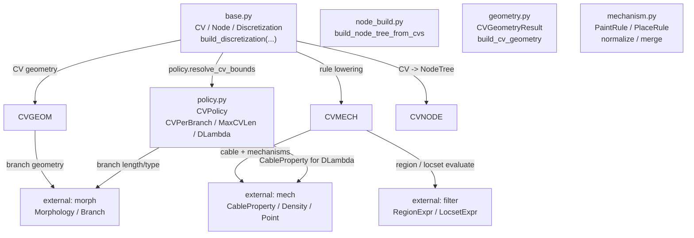
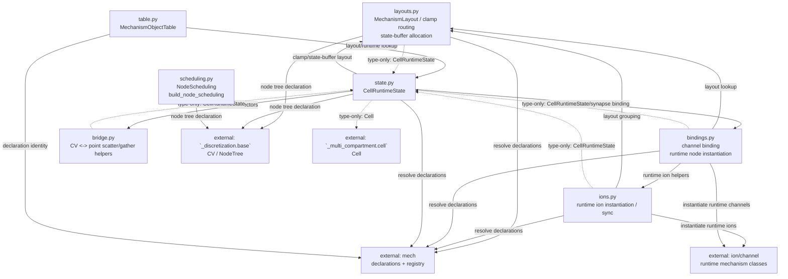
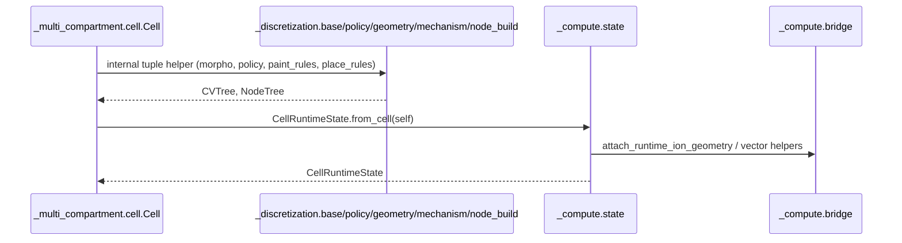
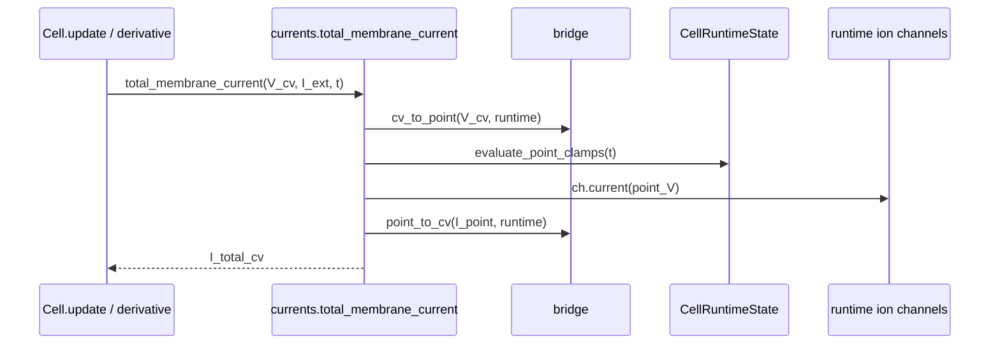

# `_multi_compartment` / `_discretization` / `_compute` 依赖图

本文只看三个目录之间和内部的关系：

- `braincell._multi_compartment`
- `braincell._discretization`
- `braincell._compute`

箭头含义：`A --> B` 表示 `A` 在实现上调用、导入或依赖 `B`。虚线表示 type-only 或调试辅助引用，不是主执行链路。

## 1. 三个包之间的主关系

```mermaid
flowchart LR
    MC["`_multi_compartment`<br/>Cell frontend<br/>cell / currents / probes / run"]
    CV["`_discretization`<br/>CV + node-tree declaration<br/>base / node_build / policy / geometry / mechanism"]
    CP["`_compute`<br/>runtime compile layer<br/>layouts / ions / bindings / state / bridge / scheduling / table"]

    MC -->|"Cell.cvs / Cell.init_state<br/>build_discretization"| CV
    MC -->|"Cell.init_state<br/>CellRuntimeState.from_cell(...)"| CP
    CP -->|"node scheduling consumes declaration node tree"| CV
```

这张图里的重点：

- `_multi_compartment.cell.Cell` 是调用方和用户入口。
- `_discretization` 负责把 `morpho + cv_policy + paint/place rules` 变成 `tuple[CV, ...]`，并在初始化路径生成 `NodeTree`。
- `_compute` 负责把 `Cell + CV/NodeTree declaration` 变成 runtime state、layout、runtime nodes，并为 solver 构造 scheduling。
- `bridge.py` 现在就在 `_compute` 内部；它的 `TYPE_CHECKING` 引用指向 `braincell._compute.state.CellRuntimeState`，运行时调用方是 `_multi_compartment.cell`（最大的调用方，约 15 处）、`_compute.state`、`_multi_compartment.currents`、`_multi_compartment.probes`。

## 2. `_multi_compartment` 内部

```mermaid
flowchart TD
    CELL["cell.py<br/>Cell<br/>paint/place/init_state/update/run"]
    BRIDGE["`_compute.bridge`<br/>CV <-> point helpers<br/>cv_to_point, point_to_cv, ..."]
    CURRENTS["currents.py<br/>total_membrane_current"]
    PROBES["probes.py<br/>sample_probe(s)"]
    RUN["run.py<br/>RunResult / run"]
    CVBASE["`_discretization.base`<br/>CV / Node / Discretization<br/>build_discretization"]
    CVNODE["`_discretization.node_build`<br/>build_node_tree_from_cvs"]
    CVPOLICY["`_discretization.policy`<br/>CVPolicy / CVPerBranch / ..."]
    CVGEOM["`_discretization.geometry`<br/>CVGeometryResult<br/>build_cv_geometry"]
    CVMECH["`_discretization.mechanism`<br/>PaintRule / PlaceRule<br/>normalize / merge"]
    CPSTATE["`_compute.state`<br/>CellRuntimeState"]
    CPTABLE["`_compute.table`<br/>MechanismObjectTable"]
    CPTOPO["`_compute.scheduling`<br/>build_node_scheduling"]

    CELL -->|"imports"| BRIDGE
    CELL -->|"compute_membrane_derivative"| CURRENTS
    CELL -->|"sample_probe(s)"| PROBES
    CELL -->|"run(...)"| RUN

    CURRENTS -->|"V_cv -> point_V<br/>I_point -> I_cv"| BRIDGE
    PROBES -->|"point/CV conversions"| BRIDGE

    CELL -->|"cvs / init_state"| CVBASE
    CELL -->|"paint/place normalization"| CVMECH
    CELL -->|"policy setter/default"| CVPOLICY
    CELL -->|"runtime facade"| CPSTATE
    CELL -->|"mech_table"| CPTABLE
    CELL -->|"node_tree"| CPTOPO
```

`cell.py` 是这个目录的中心文件：

- 声明期：`paint(...)` / `place(...)` 走 `_discretization.mechanism.normalize_*` 和 `merge_*`。
- 预览期：`cvs` 属性走 `_discretization.base.build_discretization(...)`，再取 `.cvs`。
- 初始化：`init_state(...)` 走 `_discretization.base.build_discretization(...)`，一次拿到 `CVTree + NodeTree`，再走 `_compute.state.CellRuntimeState.from_cell(...)`。
- 运行期：`compute_membrane_derivative(...)` 调 `currents.total_membrane_current(...)`；`run(...)` 委托给 `run.py`；probe 查询委托给 `probes.py`。

## 3. `_discretization` 内部



`_discretization` 的主执行链很短：

1. `Cell.cvs` 调 `build_discretization(...).cvs`。
2. `Cell.init_state()` 内部一次构建 `CVTree + NodeTree`。
3. `build_discretization(...)` 调 `policy.resolve_cv_bounds(...)` 决定每个 branch 的 CV 区间。
4. `geometry.build_cv_geometry(...)` 产出静态 CV 几何。
5. `mechanism.build_cv_mechanisms(...)` 再把 point mechanisms 按 locset 映射到对应的 `Node.point_mech`。

代表接口只需要记这些：

- `CV`：`region`、`diam_mid`、`...`
- `build_discretization(...)`
- `NodeTree` / `build_node_tree_from_cvs(...)`
- `PaintRule` / `PlaceRule`
- `normalize_paint_rules(...)` / `normalize_place_rule(...)`
- `merge_paint_rules(...)` / `merge_place_rules(...)`
- `CVPolicy.resolve_cv_bounds(...)`

## 4. `_compute` 内部



`_compute` 现在没有单一中心模块，职责按依赖顺序拆成几层：

- `layouts.py` 是最底层：`MechanismLayout` 记录、clamp routing、state buffer 分配，运行时对包内其他模块无依赖；仅在 `TYPE_CHECKING` 下引用 `state.py` 的 `CellRuntimeState` 做类型标注。
- `ions.py` 依赖 `layouts.py`，负责 runtime ion 实例的构建与同步；同样仅在 `TYPE_CHECKING` 下引用 `state.py` 的 `CellRuntimeState`。
- `bindings.py` 依赖 `ions.py` 和 `layouts.py`，负责 channel binding 与 runtime node 实例化；同样仅在 `TYPE_CHECKING` 下引用 `state.py` 的 `CellRuntimeState`。
- `state.py` 依赖 `bindings.py`、`bridge.py`、`layouts.py`，把上面几层聚合成 `CellRuntimeState` 门面；对 `_multi_compartment.cell.Cell` 的引用只在 `TYPE_CHECKING` 下出现。
- `bridge.py` 现在是 `_compute` 内部模块，提供 CV <-> point 的 scatter/gather helper，运行时对包内其他模块无依赖；同样仅在 `TYPE_CHECKING` 下引用 `state.py` 的 `CellRuntimeState`。
- `table.py` 依赖 `state.py`，是 inspect/debug/query 层，用 runtime layout 和 declaration 生成 mechanism table。
- `scheduling.py` 只保留 `NodeScheduling`；`NodeTree` 的真实定义在 `_discretization.base`，node 构建细节在 `_discretization.node_build`；它与本包其余模块之间没有依赖关系。

## 5. `Cell.init_state()` 路径



## 6. `Cell.update()` / current 路径



## 7. 最小记忆版

- `_multi_compartment.cell` 是入口和编排层。
- `_discretization.base.build_discretization(...)` 是静态离散入口；CV 预览通过 `.cvs` 取得。
- `_discretization.node_build` 把 CV 变成 node tree，并承载 endpoint/midpoint point mechanism placement。
- `_compute.scheduling` 只做 node scheduling 和兼容导出。
- `_compute.state` 把 Cell declaration 变成 runtime state（依赖 `layouts` / `bindings` / `bridge`；`ions` 只通过 `bindings` 间接可达）。
- `_compute.bridge` 是 CV-space 和 point-space 的转换工具，被 `_multi_compartment.cell`（最大的调用方）、`_compute.state`、`currents`、`probes` 共同使用。
- `_compute.layouts/ions/bindings` 是真正的实现模块，按 `layouts -> ions -> bindings -> state` 的顺序逐层依赖，不是 re-export。
