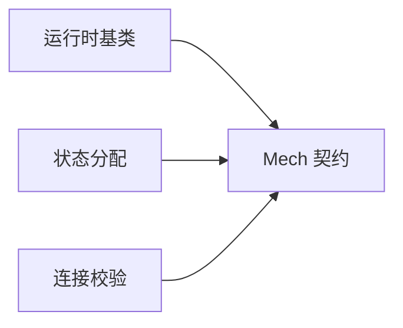

# Network Module Layout

Network 需要被 Cell 在导入过程中使用，又依赖 Cell 的连接和运行实现。
稳定导入的关键是依赖具体子模块，并把共享声明契约放在 Mech。
状态归属和执行流程见 [Network 架构](architecture.md)。

## 模块职责

| 模块 | 职责 |
| --- | --- |
| core | Population、NetworkResult |
| event | EventSource、EventTable、EventSequence、NetStim、VoltageCrossingSource |
| recording | RecordingSpec、RecordingSchema、SampleBlock、EventSeries、observe |
| connection | connect、ConnectionView、NetworkConnections |
| pairing | PairingSpec、score/degree 上下文与临时端点配对 |
| engine | Network 生命周期与运行 |
| lowering | 声明转为 ConnectionBlock |
| delivery | delay queue、稀疏路由与事件累加 |
| mech/_event_contract | 目标机制声明的事件输入契约 |
| mech/_synapse_schema | 目标机制的静态字段声明 |

## 依赖约束

下面只画共享契约的依赖，箭头表示“使用声明”，不是完整 Python import 图：

EventInput 描述目标能消费何种 payload，StateSpec 描述目标状态。
基类、状态分配和连接校验都读取它们，所以放在不导入其他 braincell 包的 Mech 中。
具体模型导入时向 registry 注册自己，Mech 不反向导入模型。

core/event/recording 是 Network 内部的低层模块，但仍依赖 `_misc`、`_parameter_schema` 等基础代码；
“低层”不表示完全没有 braincell 导入。

## 部分初始化的父包

Cell 和 compute 在模块顶层导入 network.event/recording，Python 会先执行 network/__init__.py。
此时 `_multi_compartment` 父包可能尚未完成初始化。因此从 Network eager 可达的模块，
不能使用 `from braincell._multi_compartment import Cell` 这类父包名字导入。
依赖 `.cell`、`.synapses`、`.run` 等具体子模块可以按当前导入图解析。

network/__init__.py 当前直接绑定 Network、Population、NetworkResult 等导出，无延迟 `__getattr__`。
可否 eager 导入由上面的父包约束决定，不由文件大小决定。

| 检查 | 保证的性质 |
| --- | --- |
| PartialParentTest | eager 可达模块不从 `_multi_compartment` 包根导入名字 |
| ImportGraphTest | 包内依赖符合显式 DAG |
| MechIsALeafTest | Mech 不导入其他 braincell 包 |

这些检查位于 [network/__init___test.py](../../../../braincell/network/__init___test.py)。
历史拆分和旧验收记录见 [Network 历史验证](../../../specs/2026-09-07-network-verification-snapshot.md)。
